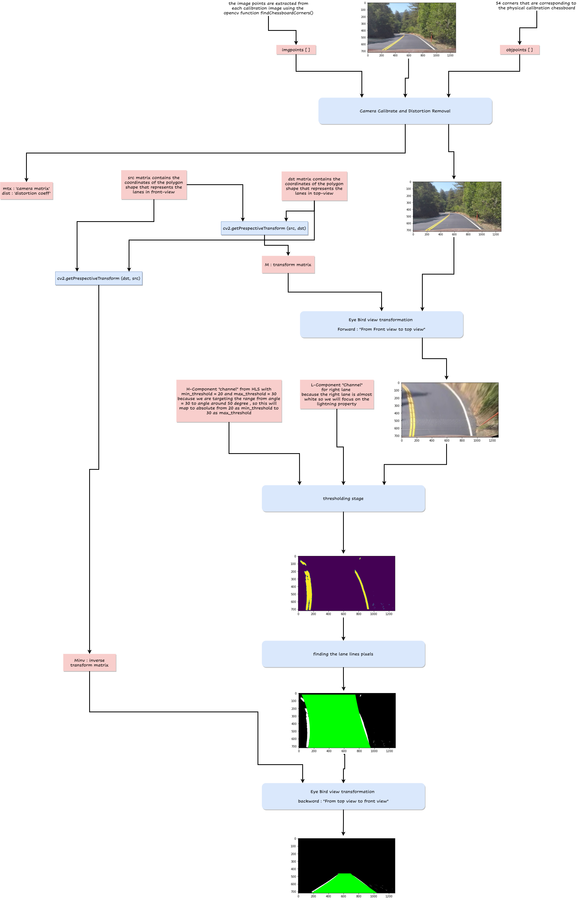

# Advanced-Lane-Detetction-phase-1

## we beleive that diagrams worth thousand words, so this is the high level diagram which represents the pipeline of the project starting from reading a frame to detecting the lane curves and lines.

## [1] Camera calibration and distortion correction
- We know that when the camera transforms the 3D object points to 2D image points, we will have a distortion in the frames that our camera reads.
- Due to this distortion, we will face problems in some parts of the image which will effect the pipeline process.
- OpenCV provides three functions, namely, **`cv2.findChessboardCorners`**, **`cv2.calibrateCamera`** and **`cv2.undistortto`**.
- We will use a set of chessboard images to calibrate the camera.
### steps:
> * Define a set of object points that represent inside corners in a set of chessboard images.
> * Map the object points to images points by using **`cv2.findChessboardCorners`**.
> * Call **`cv2.calibrateCamera`** with this newly created list of object points and image poins to compute the camera calibration matrix and distortion coefficients.
> * Finally, we can undistort raw images by passing them into **`cv2.undistort`** along with the two params calculated above.

## [2] Perspective Transformation & Region Of Interest Specification
- Now we have an undistorted image, but we also have a lot of unimportant parts of our frame that represent a noise because we are interested in lanes only.
- Since that we have the front-view of the road, we still have these unimportant shapes in our frame (such as trees, other cars ..), So we need to get another view of our frame to focus only on the lanes.
- Imagine that we have an Eye-bird view of our lanes, where we can see the actual view of the lanes "parallel", and we can focus on the lanes only.
- Perspective Transformation which warpes the image into a bird's eye view scene. This makes it easier to detect the lane lines (since they are relatively parallel) and measure their curvature.
### steps:
> * Specify the source coordinates (from front-view) and destination coordinates (from Eye-bird view) to be able to transform from one view to another.
> * Compute the transformation matrix by passing the source and destination points into **`cv2.getPerspectiveTransform`**. These points are determined empirically.
> * Then the undistorted image is warped by passing it into **`cv2.warpPerspective`** along with the transformation matrix.
> * We defined 2 functions: **`get_eye_bird_view()`** which gets the top-view from front-view, and the **`get_front_view()`** which gets back the front-view from top-view 
